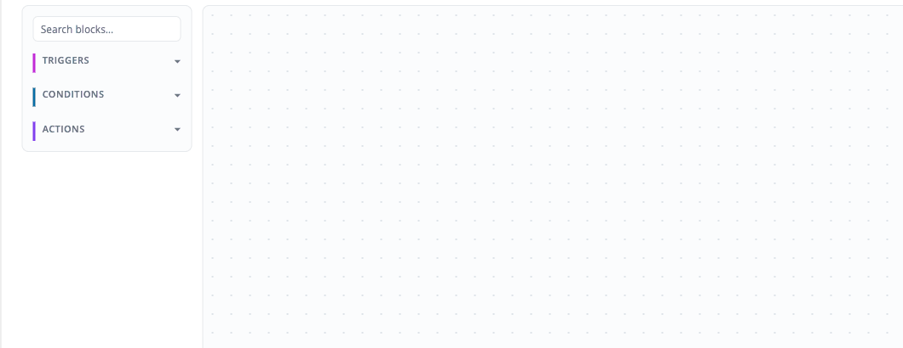

# Ordo — Marketing Automation for Magento Open Source


[](https://github.com/michalper/ordo/actions/workflows/ci.yml)
[](https://codecov.io/gh/michalper/ordo)
[](https://sonarcloud.io/project/overview?id=michalper_ordo)
[](composer.json)
[](composer.json)
[](LICENSE)
[](.github/dependabot.yml)
[](phpcs.xml.dist)
[](https://github.com/michalper/ordo/issues)

*[Czytaj po polsku](README.pl.md)*

A Klaviyo/HubSpot-style campaign engine (trigger → conditions → actions, drag-and-drop canvas) that runs *inside*
stock Magento Open Source — no Adobe Commerce B2B license, no per-contact MA subscription. Triggers are computed
from data Magento already has (orders, quotes, customers, carts), or from a small first-party data model added
alongside it.

Covers both classic B2C lifecycle automation (abandoned cart, win-back) and B2B triggers most external MA tools
can't see at all — credit limit alerts, order approval workflows, reorder reminders — because they never had
access to that data.



## Features

**B2B**

- Reorder reminders based on a customer's own purchase history.
- Offer/quote expiry reminders (`ordo_offer`).
- Credit limit alerts (cron + `GET /V1/ordo/credit-limit/mine`), with an optional hard checkout block at 100%
  utilization.
- Order approval workflow — orders above a per-customer spend limit are held for a token-based admin approve/reject
  email, with escalation for unresolved approvals.
- Free gift above a cart threshold — admin-defined gift pool with cascading cart-subtotal tiers, selected via REST.

**B2C**

- Abandoned cart recovery, capped per cart.
- Welcome email on registration.
- Win-back / re-engagement email after N days of inactivity, self-clearing once the customer orders again.
- SMS recovery (Twilio) — a `send_sms` campaign action, with delivery-status tracking and opt-out handling.
- WhatsApp (Meta Cloud API) — a `send_whatsapp` campaign action sending pre-approved templates, with its own
  admin-managed template approval lifecycle and delivery-status webhook.
- Web Push notifications — a `send_push` campaign action delivering real browser/OS notifications (RFC 8291/8292,
  no vendor SDK), to every device a customer has subscribed from.
- Price-drop / back-in-stock alerts — a customer/visitor watches a product from its PDP, two scan crons dispatch
  `price_drop`/`back_in_stock` campaign triggers on the first real change.

**Shared foundation**

- Behavioral tagging — the segmentation primitive every trigger above reads or writes.
- Sales-rep signature on automated emails; a weekly digest groups inactive customers by rep.
- Campaign engine — a "when X happens and Y is true, do Z" rule engine, with conditions/actions as
  `di.xml`-registered plug-ins and a full REST service contract.
- Predictive send-time optimization — opt-in per `send_email` action, defers to each customer's own
  historically-best email open/click hour (email-only: the only channel with open/click data).
- On-site behavior tracking — a dependency-free JS snippet turning page/product/category views into campaign-engine
  tags.
- Admin UI — dashboard, campaign builder (editable [Drawflow](https://github.com/jerosoler/Drawflow) trigger(s) →
  conditions → actions canvas, multiple triggers per campaign), campaign calendar (trigger/action timing across all
  campaigns), free gift offer builder, reorder-cycles diagnostic grid.

Every feature has its own config toggle under **Stores → Configuration → Ordo Automation** and its own cron job.

## Install

```bash
composer require michalper/ordo
bin/magento module:enable Ordo_Automation
bin/magento setup:upgrade
bin/magento cache:flush
```

## Documentation

- [ROADMAP.md](ROADMAP.md) — what's still open.
- [docs/CHANGELOG.md](docs/CHANGELOG.md) — implementation history.
- [docs/ARCHITECTURE.md](docs/ARCHITECTURE.md) — directory/class map.
- [VERIFICATION.md](VERIFICATION.md) — install/test checklist run against a real Magento instance.
- [API.md](API.md) — REST service contract reference.
- [CONTRIBUTING.md](CONTRIBUTING.md) — quality/testing requirements for changes.
- Localization: `i18n/` CSVs, keyed off `en_US.csv`. Shipped: `en_US`, `pl_PL` (native-reviewed), `de_DE`, `fr_FR`,
  `es_ES`, `it_IT`, `pt_BR`, `zh_Hans_CN`, `ja_JP`, `ru_RU`, `uk_UA`, `nl_NL` (machine-translated, pending native
  review).

## License

MIT — see [LICENSE](LICENSE).

Copyright (c) 2026 Michał Per.
