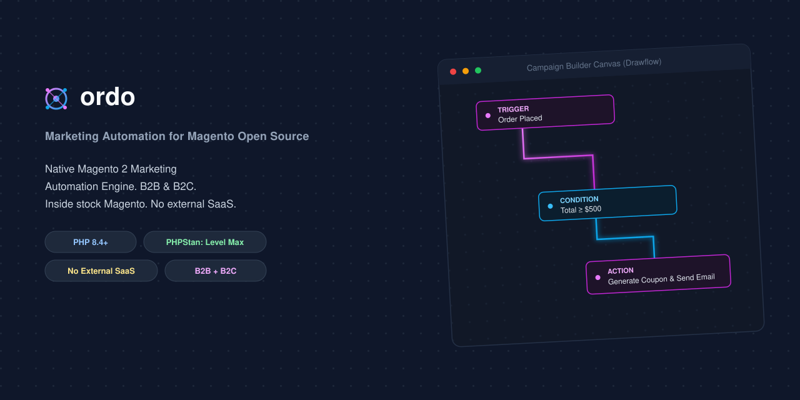

# Ordo Automation dla Magento 2



[](https://github.com/michalper/ordo/actions/workflows/ci.yml)
[](https://codecov.io/gh/michalper/ordo)
[](https://sonarcloud.io/project/overview?id=michalper_ordo)
[](composer.json)
[](composer.json)
[](https://opensource.org/licenses/OSL-3.0)
[](.github/dependabot.yml)
[](phpcs.xml.dist)
[](https://github.com/michalper/ordo/issues)

*[Read in English](README.md)*

Marketing automation działający *wewnątrz* **czystego Magento Open Source** — bez licencji Adobe Commerce B2B, bez
zewnętrznej subskrypcji MA. Każdy trigger liczony jest z danych, które Magento już ma (zamówienia, koszyki, klienci),
albo z niewielkiego własnego modelu danych dołożonego obok.

Celem tego modułu jest bycie realną alternatywą dla ogólnej platformy MA na sklepie Magento — nie garstką dodatków "w
stylu B2B" — obejmującą zarówno klasyczną automatyzację cyklu życia B2C, jak i triggery B2B, których strukturalnie nie
widzi większość zewnętrznych narzędzi MA.

## Funkcje

**B2B**

- **Przypomnienia o ponownym zamówieniu (reorder)** — przypomina klientowi przed przewidywaną datą kolejnego zamówienia,
  na podstawie jego własnej historii zakupów.
- **Przypomnienia o wygasaniu oferty/wyceny** — proaktywny e-mail "wygasa za N dni" dla własnej encji oferty
  (`ordo_offer`).
- **Alerty limitu kredytowego** — cron ostrzegający przy konfigurowalnym progu, plus status na żywo przez REST
  (`GET /V1/ordo/credit-limit/mine`).
- **Workflow akceptacji zamówień** — zamówienia powyżej limitu wydatków per klient są wstrzymywane do akceptacji przez
  administratora (link na tokenie w e-mailu), z eskalacją nierozstrzygniętych przypadków.
- **Gratis powyżej progu koszyka** — pula gratisów zdefiniowana przez administratora z kaskadowymi progami wartości
  koszyka; klient wybiera przez REST.

**B2C**

- **Odzyskiwanie porzuconych koszyków** — e-mail przypominający dla nieaktywnych koszyków powyżej konfigurowalnego
  progu, z limitem wysyłek na koszyk.
- **E-mail powitalny** — przy rejestracji klienta.
- **E-mail win-back / reaktywacyjny** — jednorazowy e-mail po N dniach nieaktywności, znikający automatycznie po
  kolejnym zamówieniu.

**Wspólny fundament**

- **Tagowanie behawioralne** — prymityw segmentacji, z którego korzysta każdy trigger powyżej.
- **Podpis opiekuna handlowego** — automatyczne e-maile podpisane danymi przypisanego opiekuna klienta; cotygodniowy
  digest grupuje nieaktywnych klientów per opiekun.
- **Silnik kampanii** — konfigurowalny silnik reguł "gdy zdarzy się X i Y jest prawdą, zrób Z", z warunkami/akcjami jako
  plug-inami rejestrowanymi w `di.xml` i pełnym kontraktem REST.
- **Śledzenie zachowań na stronie** — bezzależnościowy snippet JS zamienia odsłony stron/produktów/kategorii w tagi
  silnika kampanii.
- **Panel administracyjny** — dashboard, kreator kampanii (z podglądem tylko do odczytu trigger → warunki → akcje na
  bazie [Drawflow](https://github.com/jerosoler/Drawflow)), kreator ofert gratisów i diagnostyczny grid cykli reorder.

Wszystko konfigurowalne pod **Stores → Configuration → Ordo Automation** (albo, dla kampanii i gratisów, przez ich REST
API), każda funkcja z własnym przełącznikiem włącz/wyłącz i zadaniem cron. Szczegóły implementacji i uzasadnienie
decyzji projektowych są w [CHANGELOG.md](CHANGELOG.md); to, co wciąż w toku — w [ROADMAP.md](ROADMAP.md).

## Architektura

```
etc/
  module.xml, di.xml, crontab.xml, db_schema.xml, events.xml, email_templates.xml, acl.xml, webapi.xml
  adminhtml/system.xml          — konfiguracja sklepu
  frontend/routes.xml           — /ordo/approval/* (na tokenie, bez logowania)
Api/, Api/Data/                 — kontrakty usług: Offer*, Campaign*, Campaign/ConditionInterface, Campaign/ActionInterface
Cron/
  CalculateReorderCycle.php, SendReorderReminders.php
  SendAbandonedCartReminders.php
  SendOfferExpiryReminders.php, ExpireOverdueOffers.php
  SendCreditLimitAlerts.php
  TagInactiveCustomers.php, SendWinBackEmails.php
  EscalateStalePendingApprovals.php
  SendSalesRepDigest.php
Observer/
  SendWelcomeEmail.php                        — customer_register_success
  HoldOrderForApproval.php                    — sales_order_place_after
  DispatchOrderPlacedCampaigns.php            — sales_order_place_after
  DispatchCustomerRegisteredCampaigns.php     — customer_register_success
  DispatchTagAddedCampaigns.php               — ordo_customer_tag_added (zdarzenie własne)
Controller/Approval/            — Approve.php, Reject.php (akcje frontowe na tokenie)
Model/, Model/ResourceModel/     — ordo_reorder_cycle, ordo_offer, ordo_customer_tag, ordo_order_approval, ordo_campaign(_condition/_action)
Model/Campaign/                  — ConditionPool, ActionPool, Condition/*, Action/* (rejestr plug-inów)
Model/CampaignDispatcher.php     — "event triggera + kontekst na wejściu, pasujące kampanie się wykonują"
Model/Rule/Action/Discount/      — CheapestItemFree (własny kalkulator SalesRule), QualifyingSetTracker
view/adminhtml/ui_component/sales_rule_form.xml — rozszerza natywny formularz Cart Price Rule o podgląd na żywo "Buy X Get Y"
view/adminhtml/web/js/buy-x-get-y-calculator.js — kalkulator podglądu (tylko do odczytu, bez nowej logiki rabatowej)
Block/Adminhtml/Campaign/Edit/Flow.php — buduje graf Drawflow (trigger/warunki/akcje) na stronie edycji kampanii
view/adminhtml/web/lib/drawflow/     — wgrany Drawflow (MIT) — https://github.com/jerosoler/Drawflow
Controller/Adminhtml/Campaign/, ReorderCycle/, FreeGiftOffer/ — kontrolery gridu/formularza adminowego
Block/Adminhtml/Campaign/Edit/, FreeGiftOffer/Edit/ — bloki przycisków toolbara (Back/Delete/Save & Continue)
Ui/Component/Listing/Column/     — CampaignActions, FreeGiftOfferActions (linki Edit/Delete w wierszach)
view/adminhtml/ui_component/     — ordo_campaign_listing/form, ordo_reorder_cycle_listing, ordo_free_gift_offer_listing/form
Model/CreditLimitCalculator.php  — used-credit liczone z otwartych sales_order.total_due
Model/CreditLimitManagement.php  — wrapper REST-owy (mine / po id klienta) nad kalkulatorem powyżej
Model/FreeGiftOffer(Tier/Product).php, Model/FreeGiftManagement.php — oferty gratisów z kaskadowymi progami + wybór
Model/QuoteGiftItem.php          — znacznik łączący quote_item z ofertą, z której gratis został przyznany
Observer/TrimExcessFreeGifts.php — usuwa gratisy, które przestały się kwalifikować przy spadku wartości koszyka
Model/CustomerTagManager.php     — add/remove/check/list-by-tag; wystrzeliwuje ordo_customer_tag_added
Model/CouponGenerator.php        — generuje jednorazowy kod kuponu SalesRule
Model/SalesRepEmailContext.php   — współdzielony blok podpisu w e-mailu
Setup/Patch/Data/                — atrybuty klienta (limit kredytowy/wydatków, e-mail administratora akceptacji, opiekun), status zamówienia Pending Approval
Helper/Config.php                — typowany dostęp do wartości z system.xml
view/frontend/email/             — szablony e-mail
Controller/Track/Event.php       — publiczny, zwolniony z CSRF endpoint śledzenia
Model/VisitorEventLogger.php     — zapisuje ordo_visitor_event, uruchamia agregację gdy tożsamość jest znana
Model/VisitorAggregator.php      — surowe eventy → tagi ordo_customer_tag po przekroczeniu progu
view/frontend/web/js/tracker.js  — bezzależnościowy snippet cookie odwiedzającego + eventów
Test/Unit/                       — testy PHPUnit (aktualny stan pokrycia w ROADMAP.md, Faza 6)
i18n/                            — pliki CSV tłumaczeń (en_US, pl_PL)
```

## Instalacja

```bash
composer require ordo/module-automation
bin/magento module:enable Ordo_Automation
bin/magento setup:upgrade
bin/magento cache:flush
```

## Standardy jakości i testowania (reguła projektu, nie aspiracja)

To są wiążące reguły tego repozytorium na przyszłość, nie lista życzeń "kiedyś" — każda nowa klasa dodana od tego
momentu powinna je spełniać, a istniejący kod jest sukcesywnie doprowadzany do tego samego poziomu (śledzone w
`ROADMAP.md`, Faza 6):

- **Analiza statyczna: PHPStan na poziomie `level: max`**, skonfigurowany w `phpstan.neon` z
  rozszerzeniem [bitexpert/phpstan-magento](https://github.com/bitexpert/phpstan-magento), żeby magia Magento (fabryki,
  proxy, tłumaczenie `__()`, magiczne gettery EAV) nie generowała fałszywych alarmów. Działa tylko jako `require-dev` —
  nigdy nie trafia na produkcyjną instalację.
- **Testy jednostkowe (PHPUnit)** dla każdej klasy z nietrywialną logiką — `Model/`, `Cron/`, `Helper/`, `Controller/`.
  `Test/Unit/Model/SalesRepEmailContextTest.php` to test-zalążek ustalający wzorzec mockowania (`createMock` na
  interfejsach, bez prawdziwego bootstrapu Magento).
- **MFTF (Magento Functional Testing Framework)** pokrycie end-to-end dla każdego flow widocznego dla klienta i
  administratora: złożenie zamówienia powyżej limitu wydatków → e-mail → link akceptuj/odrzuć → zmiana statusu
  zamówienia; samodzielne przedłużenie wygasającej oferty przez klienta; itd. Zgodnie
  z [przewodnikiem MFTF Adobe](https://developer.adobe.com/commerce/testing/functional-testing-framework/getting-started).
- **Testy API** dla każdego kontraktu usługi w `Api/` — zobacz `API.md` i `Test/Api/README.md`.
- **Cel: ~100% pokrycia kodu.** Aktualny (lub nieaktualny) zmierzony stan w `ROADMAP.md`, Faza 6, oraz
  `VERIFICATION.md` — co jest dziś pokryte, w porównaniu z garstką linii faktycznie nieosiągalnych.

## Lokalizacja

Etykiety widoczne w adminie (`system.xml`, etykiety atrybutów klienta) są tłumaczalne przez standardowe pliki CSV i18n
Magento w `i18n/`, kluczowane względem `en_US.csv` jako źródła. Aktualnie dostępne: `en_US`, `pl_PL`. Zgłoszenia/prośby
o kolejne lokalizacje śledzone są w `ROADMAP.md`, Faza 6 — celem jest pokrycie każdego języka realnie istotnego dla bazy
klientów sklepu, nie tylko symboliczny drugi język.

## Roadmapa

Historia wdrożonych funkcji i wszystko, co wciąż otwarte (fazy w toku, znane luki, elementy "jeszcze niezbudowane") żyje
w **[ROADMAP.md](ROADMAP.md)** (po angielsku), nie tutaj — to README opisuje tylko stabilny, aktualny stan modułu.

## Wypróbowanie na żywo

**Zweryfikowane end-to-end na Magento Open Source 2.4.7, 2026-08-26**
(Docker, Magento sklonowane z GitHub — bez kluczy Adobe Marketplace). Każdy punkt checklisty w `VERIFICATION.md`, sekcje
1–7, przeszedł pozytywnie na prawdziwej, żywej instancji: instalacja, analiza statyczna, pełny panel administracyjny
(dashboard, kreator kampanii z dedykowanymi polami per typ, gridy), każdy cron triggera B2B, silnik kampanii (łącznie z
łańcuchem
`generate_coupon` → `send_email` i triggerem `tag_added`), kalkulator promocji
`CheapestItemFree`, śledzenie na stronie w prawdziwej przeglądarce, i — najtrudniejsze — prawdziwe zamówienie złożone
przez pełny checkout sklepowy, wstrzymane do akceptacji, zaakceptowane przez prawdziwy link i odblokowane.

**Po drodze znaleziono i naprawiono 20 prawdziwych błędów** — złe punkty rozszerzeń DI, ciche gubienie wartości
atrybutów EAV, pułapkę domyślnej konfiguracji obecną w 12 miejscach i więcej. Pełna lista, z dokładnym opisem jak każdy
został znaleziony i zweryfikowany, w `VERIFICATION.md`.

**Co wciąż jest faktycznie otwarte:** zobacz [ROADMAP.md](ROADMAP.md) — nie porażki, nie próbowane, albo świadomie
odłożone.

**Pełna checklista krok po kroku:** [VERIFICATION.md](VERIFICATION.md) — obejmuje instalację, analizę statyczną i ręczny
przegląd każdej funkcji z tego README, zorganizowana tak, żeby porażka na dowolnym kroku wskazywała dokładnie, co
naprawić dalej.

## Changelog

Zobacz [CHANGELOG.md](CHANGELOG.md).

## Licencja

OSL-3.0 (tak jak core Magento).
