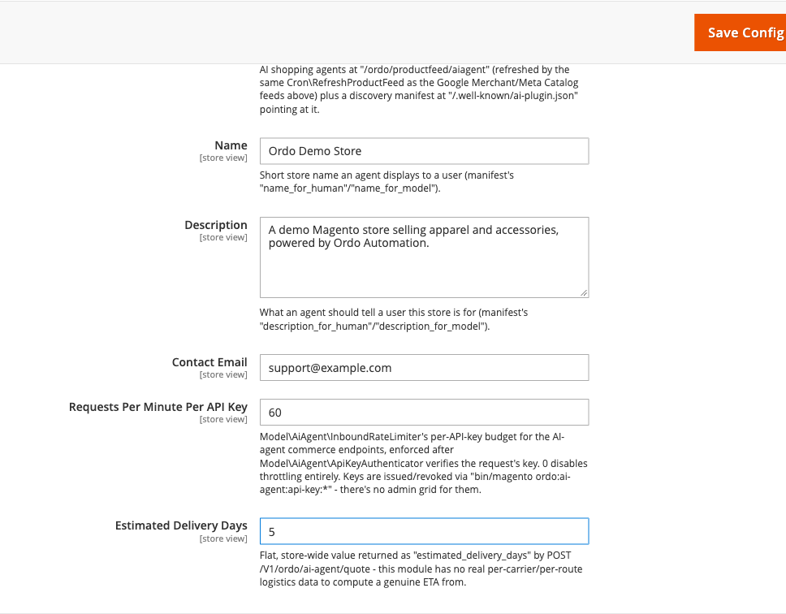

[Polski](#polski) | [English](#english)

# Polski

# Gotowość na agentów AI (GEO)

Trzy elementy, które razem robią sklep "widocznym" i "obsługiwalnym" dla autonomicznych agentów
zakupowych AI (np. asystentów zakupowych, botów porównujących ceny) — w odróżnieniu od SEO, które
optymalizuje pod ludzi i wyszukiwarki, to są odpowiedniki pod boty, które same przeglądają katalog
i same składają zapytania o cenę.

## 1. Feed `ai_agent`

Trzeci format eksportu katalogu (obok Google Merchant Center i Meta Catalog), ale w prostym,
płaskim JSON-ie zamiast dialektu konkretnej platformy — pole `sku`, `name`, `price`, `currency`,
`in_stock`, `url`, `image_url`, żadnych namespace'ów XML. Dostępny pod
`/ordo/productfeed/aiagent`, odświeżany co 6 godzin tym samym cronem co pozostałe dwa feedy.

## 2. Manifest `/.well-known/ai-plugin.json`

Dokument "odkrywczy" wskazujący agentowi, gdzie jest feed i jak nazywa się sklep. To jedyna trasa
w tym module bez frontName Magento — obsługiwana przez własny router zarejestrowany w
`etc/frontend/di.xml`.

```json
{
  "schema_version": "v1",
  "name_for_human": "Nazwa sklepu",
  "description_for_human": "Opis sklepu",
  "auth": {"type": "none"},
  "api": {"type": "product_feed", "format": "application/json", "url": ".../ordo/productfeed/aiagent"},
  "contact_email": "..."
}
```

## 3. Endpoint wyceny `POST /V1/ordo/ai-agent/quote`

Agent podaje listę SKU+ilości oraz adres dostawy, w odpowiedzi dostaje cenę, rabat, koszt
wysyłki (najtańsza dostępna metoda) i sumę — jednym zapytaniem, bez zakładania konta czy koszyka.
SKU, którego nie ma w katalogu, jest po prostu pomijany i zgłaszany w `unmatched_skus`, nie
wywala całego zapytania.

```
POST /rest/V1/ordo/ai-agent/quote
Authorization: Bearer oaa_<klucz>
{"items": [{"sku": "24-MB01", "qty": 2}], "countryId": "US", "postcode": "10001"}

→ 200 {"currency": "USD", "subtotal": 60, "shipping_amount": 5, "grand_total": 65, ...}
```

**To NIE jest anonimowy dostęp bez kontroli** — mimo że trasa REST jest oznaczona jako
`anonymous` (bo agent AI nie ma sesji klienta/admina Magento), prawdziwą bramką jest klucz API w
nagłówku `Authorization`. Brak/zły klucz → `401`. Przekroczony limit zapytań na minutę → `429`.
Funkcja wyłączona → `404`.

## Zarządzanie kluczami API

Nie ma siatki w adminie — klucze wydaje się z linii poleceń (bo to poświadczenia maszynowe, nie
coś, co admin przegląda codziennie):

```bash
bin/magento ordo:ai-agent:api-key:generate "Nazwa integracji"
bin/magento ordo:ai-agent:api-key:list
bin/magento ordo:ai-agent:api-key:revoke <id>
```

Klucz w postaci jawnej pokazuje się **tylko raz**, przy generowaniu — w bazie trzymany jest
wyłącznie jego hash.

## Konfiguracja

**Sklepy → Konfiguracja → Ordo Automation → AI-Agent Commerce Readiness**: włącz/wyłącz (jeden
przełącznik dla feedu i manifestu), nazwa i opis sklepu (do manifestu), e-mail kontaktowy, limit
zapytań na minutę na klucz API, oraz szacowany czas dostawy w dniach (wartość stała dla całego
sklepu — moduł nie ma prawdziwych danych logistycznych per przewoźnik/trasa).



## Co celowo NIE wchodzi w zakres

Serwer MCP (osobny proces, nie-PHP) oraz bezobsługowy/programowalny checkout (domena płatności,
nie automatyzacji marketingu) — to osobne, przyszłe decyzje.

---

# English

# AI-agent commerce readiness (GEO)

Three pieces that together make a store "visible" and "actionable" for autonomous AI shopping
agents — the equivalent of SEO, but aimed at bots that browse the catalog and ask for pricing
themselves, not humans or search engines.

## 1. The `ai_agent` feed

A third catalog export format (alongside Google Merchant Center and Meta Catalog), but a plain,
flat JSON array instead of a platform-specific dialect — `sku`, `name`, `price`, `currency`,
`in_stock`, `url`, `image_url` fields, no XML namespaces. Served at `/ordo/productfeed/aiagent`,
refreshed every 6 hours by the same cron that already refreshes the other two feeds.

## 2. The `/.well-known/ai-plugin.json` manifest

A discovery document pointing an agent at the feed and telling it the store's name. This is the
only route in this module with no Magento frontName — served via a dedicated router registered
in `etc/frontend/di.xml`.

```json
{
  "schema_version": "v1",
  "name_for_human": "Store name",
  "description_for_human": "Store description",
  "auth": {"type": "none"},
  "api": {"type": "product_feed", "format": "application/json", "url": ".../ordo/productfeed/aiagent"},
  "contact_email": "..."
}
```

## 3. The quote endpoint, `POST /V1/ordo/ai-agent/quote`

An agent supplies a list of SKUs+quantities plus a shipping address, and gets back price,
discount, shipping cost (the cheapest available method), and grand total — one call, no account
or cart needed. A SKU that doesn't match anything in the catalog is simply skipped and reported
in `unmatched_skus`, not treated as a request failure.

```
POST /rest/V1/ordo/ai-agent/quote
Authorization: Bearer oaa_<key>
{"items": [{"sku": "24-MB01", "qty": 2}], "countryId": "US", "postcode": "10001"}

→ 200 {"currency": "USD", "subtotal": 60, "shipping_amount": 5, "grand_total": 65, ...}
```

**This is NOT unchecked anonymous access** — even though the REST route is marked `anonymous`
(an AI agent has no Magento customer/admin session), the real gate is the API key in the
`Authorization` header. Missing/invalid key → `401`. Over the per-minute rate limit → `429`.
Feature disabled → `404`.

## Managing API keys

There's no admin grid — keys are issued from the CLI (they're machine credentials, not something
an admin browses day to day):

```bash
bin/magento ordo:ai-agent:api-key:generate "Integration name"
bin/magento ordo:ai-agent:api-key:list
bin/magento ordo:ai-agent:api-key:revoke <id>
```

The plaintext key is shown **only once**, at generation time — only its hash is ever stored.

## Configuration

**Stores > Configuration > Ordo Automation > AI-Agent Commerce Readiness**: enable/disable (one
toggle for both the feed and the manifest), store name and description (for the manifest),
contact email, per-API-key requests-per-minute limit, and estimated delivery days (a flat,
store-wide value — this module has no real per-carrier/per-route logistics data).


## Deliberately out of scope

An MCP server (a separate, non-PHP process) and headless/programmable checkout (the payments
domain, not marketing automation) — those are separate, future decisions.
