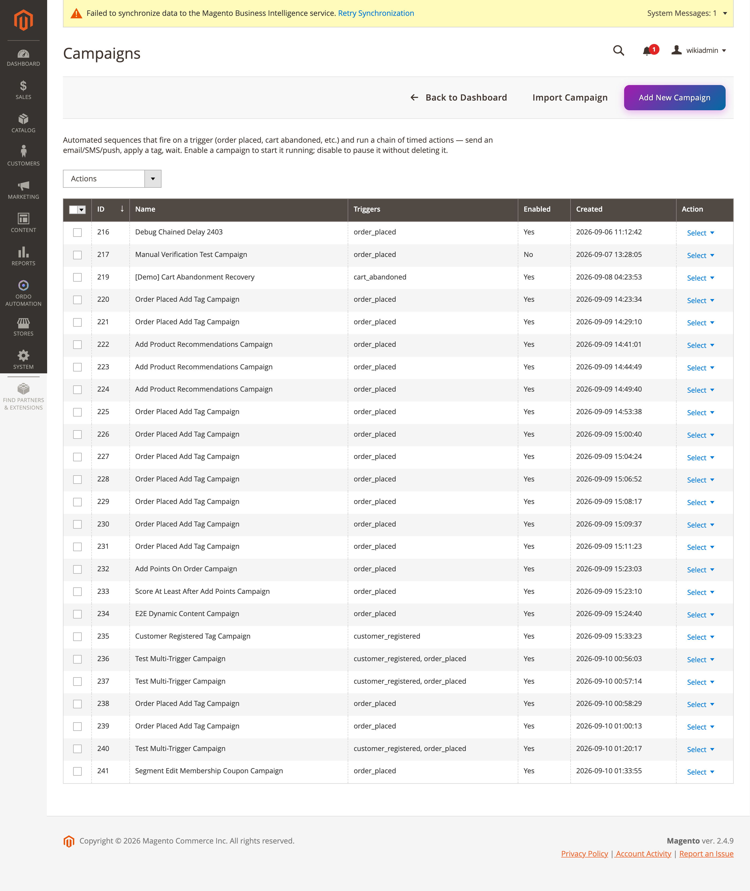

[Polski](#polski) | [English](#english)

# Polski

# Kampanie

**Ordo Automation → Dashboard → Kampanie** (`ordo/campaign/index`, kontrolery
`Controller/Adminhtml/Campaign/*` dziedziczące po `AbstractCampaignAction`, zasób ACL
`Ordo_Automation::campaigns`). Kampania to reguła "gdy zdarzy się X i Y jest prawdą, zrób Z":
trigger(y) → warunki → akcje.

## Siatka kampanii

Kolumny: ID, Nazwa, Triggery, Włączona, Data utworzenia (`view/adminhtml/ui_component/
ordo_campaign_listing.xml`). Przyciski paska narzędzi: "Back to Dashboard", "Add New Campaign",
"Import Campaign". Akcje masowe: włącz/wyłącz/usuń.

## Triggery

Typy wyzwalaczy (`Model/Config/Source/TriggerEvent.php`): złożenie zamówienia, rejestracja
klienta, dodanie tagu, porzucony koszyk, porzucone przeglądanie, dodanie tagu odwiedzającemu
(anonimowo), przekroczenie progu punktacji, zaplanowana data/godzina, harmonogram cykliczny.
Kampania może mieć więcej niż jeden trigger — każdy wpada do tego samego łańcucha
warunków/akcji (alternatywne punkty startu, nie osobne scenariusze).

## Kanwa Flow (Drawflow)

Edycja kampanii (`ordo/campaign/edit`) renderuje graficzną kanwę opartą na
[Drawflow](https://github.com/jerosoler/Drawflow) — `Block/Adminhtml/Campaign/Edit/Flow.php`
buduje graf trigger/warunek/akcja po stronie serwera z wierszy `CampaignTrigger`/
`CampaignCondition`/`CampaignAction`; `view/adminhtml/web/js/campaign-flow-editor.js` obsługuje
kanwę po stronie klienta. Przycisk "Apply flow to form" zapisuje zmiany z kanwy do tych samych pól
`triggers`/`conditions`/`actions`, których używa standardowy formularz dynamicznych wierszy —
kanwa Flow nigdy nie komunikuje się z backendem bezpośrednio, zapis idzie przez natywny zapis
formularza.

Typy warunków (`Model/Campaign/TypeLabels.php`): tag, minimalna suma zamówienia, tag
odwiedzającego, minimalny wynik punktowy, maksymalna liczba dni od ostatniego zamówienia,
minimalna częstotliwość zamówień, minimalna suma wydatków, trzy warunki percentylowe RFM,
w segmencie / nie w segmencie, minimalny poziom lojalności, minimalny wynik NPS, zakupiony SKU,
zakupiona kategoria, wystąpienie zdarzenia.

Typy akcji: dodaj tag, wyślij e-mail, wygeneruj kupon, popup, dodaj punkty, dodaj rekomendacje
produktowe, dodaj treść dynamiczną, wyślij SMS, powiadom, ankieta NPS, wyślij WhatsApp, wyślij
push, podział (test A/B).

**Ostatnie usprawnienia UX kanwy Flow** (patrz `docs/CHANGELOG.md`):

- **Undo/redo** — przyciski na pasku narzędzi lub Ctrl/Cmd+Z, Ctrl/Cmd+Shift+Z/+Y. Stos migawek
  kanwy trzymany tylko w pamięci na czas życia strony (nie zapisywany trwale); edycje struktury
  zapisują wpis od razu, edycje pól — z debounce.
- **Duplikowanie węzła** — przycisk "⧉" obok przycisku usuwania każdego węzła; kopiuje rodzaj/typ
  i wszystkie bieżące wartości pól, ląduje z przesunięciem, bez kopiowania połączeń.
- **Wewnętrzny "Wyślij test"** — przycisk tylko na węzłach akcji `send_email`/`send_sms`/
  `send_whatsapp` (nie na `send_push`, warunkach ani triggerach); wysyła żądanie do tego samego
  endpointu (`Controller/Adminhtml/TemplateTestSend/Send.php`), z którego korzysta samodzielna
  strona Template Test Send.

## Kalendarze

Dwa osobne ekrany, mimo podobnych nazw:

- **Oś czasu akcji kampanii** (`ordo/campaign/calendar`, `Controller/Adminhtml/Campaign/
  Calendar.php`) — mimo starej nazwy klasy/URL (zachowanej dla zgodności z zakładkami), pokazuje
  względne przesunięcia czasowe trigger→akcja (np. "+1440 min"), nie konkretne daty.
- **Zaplanowany kalendarz kampanii** (`ordo/campaign/schedulecalendar`,
  `Controller/Adminhtml/Campaign/ScheduleCalendar.php`) — prawdziwa siatka miesięczna, tylko dla
  triggerów typu `scheduled_at`/`recurring_schedule`.

## Silnik dyspozytora

`Model/CampaignDispatcher.php`, zasilany przez obserwatory (`DispatchOrderPlacedCampaigns`,
`DispatchCustomerRegisteredCampaigns`, `DispatchTagAddedCampaigns`,
`DispatchVisitorTagAddedCampaigns`, `DispatchScoreThresholdCampaigns`) oraz crony
(`RunScheduledCampaignActions` — łańcuchowanie opóźnień w minutach,
`DispatchScheduledCampaignTriggers` — `scheduled_at`/`recurring_schedule`).

> 📷 Zrzut samej kanwy Flow (edycja kampanii) **nie został wykonany** — otwarcie
> `ordo/campaign/edit` w testowym środowisku kończy się błędem `LogicException: Circular
> dependency: Ordo\Automation\Model\Campaign\ActionPool depends on
> Ordo\Automation\Model\CampaignDispatcher and vice versa`. To problem środowiska/DI, nie tej
> zmiany dokumentacyjnej (poza zakresem tego zadania — tylko dokumentacja, bez zmian PHP). Do
> uzupełnienia: zrzut ekranu `admin/ordo/campaign/edit/entity_id/<id>` po naprawieniu tego
> problemu w środowisku testowym.

---

# English

# Campaigns

**Ordo Automation → Dashboard → Campaigns** (`ordo/campaign/index`, controllers
`Controller/Adminhtml/Campaign/*` extending `AbstractCampaignAction`, ACL resource
`Ordo_Automation::campaigns`). A campaign is a "when X happens and Y is true, do Z" rule:
trigger(s) → conditions → actions.

## Campaign grid

Columns: ID, Name, Triggers, Enabled, Created (`view/adminhtml/ui_component/
ordo_campaign_listing.xml`). Toolbar buttons: "Back to Dashboard", "Add New Campaign", "Import
Campaign". Mass actions: enable/disable/delete.

## Triggers

Trigger types (`Model/Config/Source/TriggerEvent.php`): Order Placed, Customer Registered, Tag
Added, Cart Abandoned, Browse Abandoned, Visitor Tag Added (anonymous), Score Threshold Crossed,
Scheduled Date/Time, Recurring Schedule. A campaign can have more than one trigger — every trigger
fans into the same conditions/actions chain (alternative starting points, not separate scenarios).

## Flow canvas (Drawflow)

Editing a campaign (`ordo/campaign/edit`) renders a graphical canvas built on
[Drawflow](https://github.com/jerosoler/Drawflow) — `Block/Adminhtml/Campaign/Edit/Flow.php`
builds the trigger/condition/action graph server-side from `CampaignTrigger`/
`CampaignCondition`/`CampaignAction` rows; `view/adminhtml/web/js/campaign-flow-editor.js` drives
the client-side canvas. Its "Apply flow to form" button writes canvas edits into the same
`triggers`/`conditions`/`actions` fields the standard dynamic-rows form already uses — the Flow
canvas never talks to the backend directly, saving goes through the form's native save.

Condition types (`Model/Campaign/TypeLabels.php`): tag, minimum order total, visitor tag, minimum
score, recency days at most, order frequency at least, monetary total at least, the three RFM
percentile conditions, in segment/not in segment, minimum loyalty tier, minimum NPS score,
purchased SKU, purchased category, event occurred.

Action types: add tag, send email, generate coupon, popup, add points, add product
recommendations, add dynamic content, send SMS, notify, NPS survey, send WhatsApp, send push,
split (A/B test).

**Recent Flow canvas UX additions** (see `docs/CHANGELOG.md`):

- **Undo/redo** — toolbar buttons or Ctrl/Cmd+Z, Ctrl/Cmd+Shift+Z/+Y. An in-memory canvas-snapshot
  stack for the page's lifetime only (not persisted); structural edits push a history entry
  immediately, field edits are debounced.
- **Node duplication** — a "⧉" button next to each node's delete button; copies kind/type and all
  current field values, lands offset, no connections copied.
- **Inline "Send test"** — a button on `send_email`/`send_sms`/`send_whatsapp` action nodes only
  (not `send_push`, conditions, or triggers); posts to
  `Controller/Adminhtml/TemplateTestSend/Send.php`, the same endpoint the standalone Template
  Test Send page uses.

## Calendars

Two separate screens, despite similar names:

- **Campaign Action Timeline** (`ordo/campaign/calendar`,
  `Controller/Adminhtml/Campaign/Calendar.php`) — despite the older class/URL name (kept for
  bookmark compatibility), shows relative trigger→action delay offsets (e.g. "+1440 min"), not
  dates.
- **Scheduled Campaign Calendar** (`ordo/campaign/schedulecalendar`,
  `Controller/Adminhtml/Campaign/ScheduleCalendar.php`) — a real month-grid, only for
  `scheduled_at`/`recurring_schedule` triggers.

## Dispatch engine

`Model/CampaignDispatcher.php`, fed by observers (`DispatchOrderPlacedCampaigns`,
`DispatchCustomerRegisteredCampaigns`, `DispatchTagAddedCampaigns`,
`DispatchVisitorTagAddedCampaigns`, `DispatchScoreThresholdCampaigns`) and crons
(`RunScheduledCampaignActions` — delay-minutes chaining, `DispatchScheduledCampaignTriggers` —
`scheduled_at`/`recurring_schedule`).

> 📷 A screenshot of the Flow canvas itself (campaign edit) was **not captured** — opening
> `ordo/campaign/edit` in the test environment currently throws `LogicException: Circular
> dependency: Ordo\Automation\Model\Campaign\ActionPool depends on
> Ordo\Automation\Model\CampaignDispatcher and vice versa`. This is an environment/DI issue, not a
> consequence of this documentation change (out of scope here — docs-only task, no PHP changes).
> To do: capture `admin/ordo/campaign/edit/entity_id/<id>` once that's fixed in the test
> environment.

---

*Note: since this canvas issue is a real environment defect independent of this documentation
pass, it may be worth its own ROADMAP.md entry or GitHub issue if it reproduces outside this one
sandbox.*
