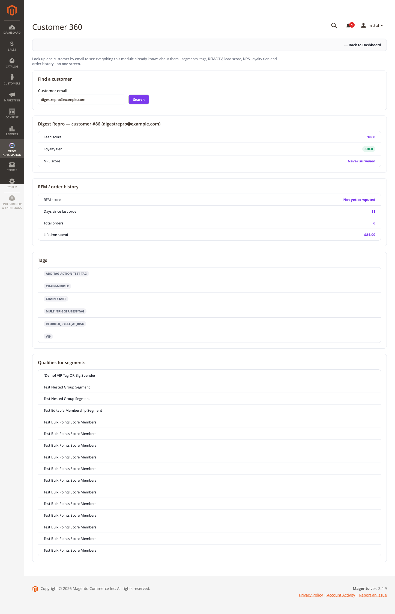

[Polski](#polski) | [English](#english)

# Polski

# Widok Customer 360

Jeden ekran w adminie, na którym widać **wszystko**, co ten moduł już wie o danym kliencie —
zamiast sprawdzania tego na pięciu osobnych ekranach (lead score, RFM, segmenty, tagi, historia
zamówień). Nic tu nie jest liczone od nowa — `Model\Customer360\Customer360SnapshotBuilder`
odczytuje te same dane z tych samych klas (`CustomerScoreManager`, `LoyaltyTierCalculator`,
`RfmCalculator`, `CustomerTagManager`, ankiety NPS, dopasowanie segmentów), z których korzysta
silnik kampanii przy każdym uruchomieniu warunku/wyzwalacza.

## Jak z tego skorzystać

1. Otwórz **Ordo Automation → Customer 360** (albo z Dashboardu — kafelek "Customer 360").
2. Wpisz e-mail klienta i kliknij Szukaj.
3. Widzisz jedną stronę z: lead score, poziomem lojalności, wynikiem NPS, statusem RFM (recency /
   frequency / monetary), liczbą i wartością zamówień, tagami klienta oraz listą segmentów, do
   których klient aktualnie się kwalifikuje.

To ekran **tylko do odczytu** — nic tu nie da się edytować. Żeby coś zmienić (np. dodać tag,
zmienić limit kredytowy), trzeba iść na właściwy ekran tej funkcji; Customer 360 istnieje po to,
żeby wiedzieć, **gdzie** szukać, zanim tam pójdziesz.

## Konfiguracja

Brak — ekran jest zawsze dostępny (kontrolowany tylko przez ACL, tak jak każdy inny ekran admina
tego modułu), nie ma osobnego przełącznika w Stores → Configuration.

---

# English

# Customer 360 view

One admin screen that shows **everything** this module already knows about a given customer,
instead of checking five separate screens (lead score, RFM, segments, tags, order history).
Nothing here is recomputed — `Model\Customer360\Customer360SnapshotBuilder` reads the same data
from the same classes (`CustomerScoreManager`, `LoyaltyTierCalculator`, `RfmCalculator`,
`CustomerTagManager`, NPS survey responses, segment matching) the campaign engine already reads
every time it evaluates a condition/trigger.

## How to use it

1. Open **Ordo Automation → Customer 360** (or from the Dashboard's "Customer 360" tile).
2. Enter the customer's email and click Search.
3. You get one page with: lead score, loyalty tier, NPS score, RFM standing (recency/frequency/
   monetary), order count and lifetime spend, the customer's tags, and every segment they
   currently qualify for.

This is a **read-only** screen — nothing here can be edited. To change something (add a tag,
adjust a credit limit), you go to that feature's own screen; Customer 360 exists to tell you
**where** to look before you go there.

## Configuration

None — the screen is always available (gated only by ACL, same as every other admin screen this
module adds), there's no separate toggle under Stores → Configuration.
