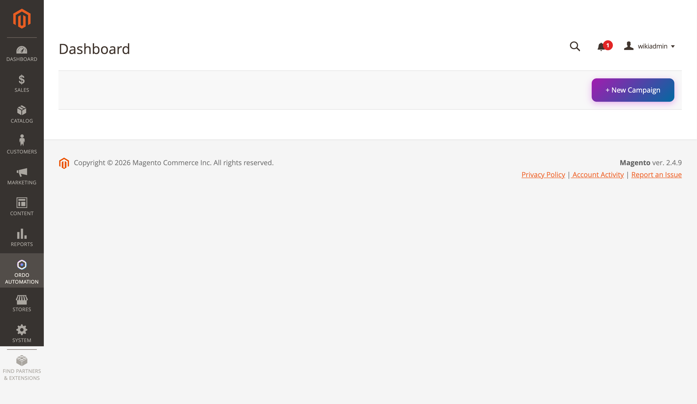

[Polski](#polski) | [English](#english)

# Polski

# Dashboard

Ekran startowy modułu: **Ordo Automation → Dashboard** (`ordo/dashboard/index`, kontroler
`Controller/Adminhtml/Dashboard/Index.php`, zasób ACL `Ordo_Automation::campaigns`). To jedyny
wpis w menu admina (`etc/adminhtml/menu.xml`) — wszystkie inne ekrany (Kampanie, Segmenty, RFM
itd.) są dostępne wyłącznie jako karty na tym dashboardzie, nie jako osobne pozycje menu.

## Co widać

Dane dostarcza `Block/Adminhtml/Dashboard/DashboardViewModel.php` (czyta bezpośrednio z kolekcji,
bez wywołania REST; liczniki cache'owane na 60 sekund) i szablon
`view/adminhtml/templates/dashboard/index.phtml`.

**Karty statystyk u góry:** liczba kampanii ogółem, liczba włączonych, liczba śledzonych cykli
ponownych zakupów, liczba ofert gratisów, "Order approvals stuck" (zamówienia czekające na
akceptację — link do `ordo/orderapproval/index`), "Crons failed (last 24h)" (link do
`ordo/cronrunlog/index`), plus wskaźnik konwersji lejka kampanii.

**Karty nawigacyjne**, pogrupowane wg celu administratora (nie wg wewnętrznej listy encji):

- **Kampanie i automatyzacja**: Kampanie (`ordo/campaign/index`), Oś czasu akcji kampanii
  (`ordo/campaign/calendar`), Zaplanowany kalendarz kampanii (`ordo/campaign/schedulecalendar`),
  Oferty gratisów (`ordo/freegiftoffer/index`).
- **Odbiorcy i targetowanie**: Segmenty (`ordo/segment/index`), Raport RFM (`ordo/rfm/index`),
  Nakładanie się segmentów (`ordo/segment/overlap`), Reguły punktacji (`ordo/scorerule/index`).
- **Kanały i treść**: Bloki treści (`ordo/contentblock/index`), Szablony WhatsApp
  (`ordo/whatsapptemplate/index`), Grupy odbiorców reklamowych (`ordo/adaudience/index`), Testowa
  wysyłka szablonu (`ordo/templatetestsend/index`).
- **Zgodność i ustawienia**: RODO/Zgody (`ordo/gdpr/index`), Konfiguracja
  (`Stores → Configuration → Ordo Automation`).

Osobna sekcja **"Diagnostyka"**, celowo umieszczona niżej: Cykle ponownych zakupów
(`ordo/reordercycle/index`), Log wiadomości (`ordo/messagelog/index`), Akceptacje zamówień
(`ordo/orderapproval/index`), Log uruchomień cronów (`ordo/cronrunlog/index`), Kondycja feedu
produktowego (`ordo/productfeed/index`) — każda opisana w kodzie jako widok tylko do odczytu.

Poniżej kart dashboard listuje też pojedyncze kampanie jako karty linkujące do ich edycji, a
przycisk "+ New Campaign"/"Dodaj kampanię" renderowany jest pod każdą kartą/tabelą, żeby główne
CTA modułu było zawsze w zasięgu bez przewijania do góry.

> 📷 Zrzut ekranu poniżej pochodzi z realnej instalacji testowej (Magento 2.4.9). W tym
> konkretnym przebiegu treść kart nawigacyjnych nie wyrenderowała się na zrzucie (widoczny tylko
> przycisk "+ New Campaign") — prawdopodobnie z powodu stanu danych/cache w środowisku testowym, a
> nie błędu w kodzie (opisane wyżej karty i statystyki są potwierdzone bezpośrednio w
> `DashboardViewModel.php` i `index.phtml`). Do uzupełnienia: świeży zrzut pełnego dashboardu z
> widocznymi kartami, ścieżka `admin/ordo/dashboard/index`.

---

# English

# Dashboard

The module's home screen: **Ordo Automation → Dashboard** (`ordo/dashboard/index`, controller
`Controller/Adminhtml/Dashboard/Index.php`, ACL resource `Ordo_Automation::campaigns`). It is the
module's only admin menu entry (`etc/adminhtml/menu.xml`) — every other screen (Campaigns,
Segments, RFM, etc.) is reachable only as a card from this dashboard, not as a separate menu item.

## What you see

Data comes from `Block/Adminhtml/Dashboard/DashboardViewModel.php` (reads collections directly,
no REST hop; stat counts cached for 60 seconds) and template
`view/adminhtml/templates/dashboard/index.phtml`.

**Top stat cards:** total campaign count, enabled count, tracked reorder-cycle count, free gift
offer count, "Order approvals stuck" (orders waiting on a decision — links to
`ordo/orderapproval/index`), "Crons failed (last 24h)" (links to `ordo/cronrunlog/index`), plus a
campaign-funnel conversion-rate stat.

**Nav cards**, grouped by merchant goal (not by internal entity list):

- **Campaigns & Automation**: Campaigns (`ordo/campaign/index`), Campaign Action Timeline
  (`ordo/campaign/calendar`), Scheduled Campaign Calendar (`ordo/campaign/schedulecalendar`), Free
  Gift Offers (`ordo/freegiftoffer/index`).
- **Audience & Targeting**: Segments (`ordo/segment/index`), RFM Report (`ordo/rfm/index`),
  Segment Overlap (`ordo/segment/overlap`), Score Rules (`ordo/scorerule/index`).
- **Channels & Content**: Content Blocks (`ordo/contentblock/index`), WhatsApp Templates
  (`ordo/whatsapptemplate/index`), Ad Audiences (`ordo/adaudience/index`), Template Test Send
  (`ordo/templatetestsend/index`).
- **Compliance & Settings**: GDPR/Consent (`ordo/gdpr/index`), Configuration
  (`Stores → Configuration → Ordo Automation`).

A separate **"Diagnostics"** section is deliberately demoted below the goal-grouped cards: Reorder
Cycles (`ordo/reordercycle/index`), Message Log (`ordo/messagelog/index`), Order Approvals
(`ordo/orderapproval/index`), Cron Run Log (`ordo/cronrunlog/index`), Product Feed Health
(`ordo/productfeed/index`) — each documented in code as a read-only view.

Below the cards, the dashboard also lists individual campaigns as cards linking to their edit
pages, and a "+ New Campaign" button is rendered under every card/table so the module's main CTA
stays reachable without scrolling back up.

> 📷 The screenshot below is from a real test install (Magento 2.4.9). In this particular capture
> the nav cards did not render (only the "+ New Campaign" button is visible) — most likely a
> data/cache state quirk of the test environment rather than a code bug (the cards and stats
> described above are confirmed directly against `DashboardViewModel.php` and `index.phtml`). To
> do: a fresh screenshot of the full dashboard with the nav cards visible, at
> `admin/ordo/dashboard/index`.

