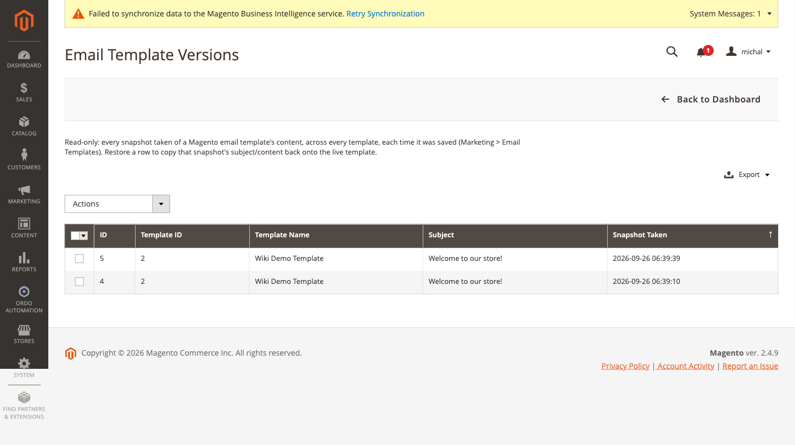

[Polski](#polski) | [English](#english)

# Polski

# Historia wersji szablonów e-mail

Wbudowany edytor szablonów e-mail w Magento (Marketing → Szablony e-mail) nie ma żadnej historii
wersji — zapis nadpisuje treść w miejscu, bez możliwości cofnięcia, jeśli edycja zepsuje coś, na
czym opiera się np. akcja kampanii "Wyślij e-mail". Ta funkcja robi migawkę (temat/treść/style)
za każdym razem, gdy dowolny szablon e-mail zostaje zapisany — niezależnie który ekran admina to
zrobił — i pozwala przywrócić dowolną wcześniejszą wersję jednym kliknięciem.

## Jak to działa krok po kroku

1. Zapisujesz dowolny szablon e-mail normalnie (Marketing → Szablony e-mail → edytuj → Zapisz).
   W tle powstaje migawka — nic nie trzeba włączać osobno przy zapisie.
2. Otwierasz **Ordo Automation → Email Template Versions** — siatka tylko do odczytu, jeden wiersz
   na każdą zapisaną migawkę, z datą zapisu.

   

3. Jeśli edycja coś zepsuła, zaznaczasz właściwy wiersz i wybierasz akcję masową "Przywróć" —
   treść/temat/style z tej migawki wracają na żywy szablon.
4. Samo przywrócenie też tworzy nową migawkę ("stan przed przywróceniem") — przywracanie nigdy nie
   jest ślepym zaułkiem, to po prostu kolejny zapis.

## Konfiguracja

**Sklepy → Konfiguracja → Ordo Automation → Email Template Version History**: jeden przełącznik
włącz/wyłącz. Wyłączenie zatrzymuje robienie nowych migawek, ale nie usuwa już zapisanych.

---

# English

# Email template version history and restore

Magento's own email template editor (Marketing > Email Templates) has no version history at
all — saving overwrites the content in place, with no way back if an edit breaks something a
"Send Email" campaign action relies on. This feature snapshots a template's subject/content/
styles every time any email template is saved — regardless of which admin screen did the
saving — and lets you restore any past snapshot with one click.

## How it works, step by step

1. Save any email template normally (Marketing > Email Templates > edit > Save). A snapshot is
   taken in the background — nothing extra to enable at save time.
2. Open **Ordo Automation > Email Template Versions** — a read-only grid, one row per saved
   snapshot, with the date it was taken.

   

3. If an edit broke something, select the right row and use the "Restore" mass action — that
   snapshot's subject/content/styles are copied back onto the live template.
4. Restoring itself also creates a new snapshot (the "before you restored" state) — restoring is
   never a dead end, it's just another save.

## Configuration

**Stores > Configuration > Ordo Automation > Email Template Version History**: a single enable/
disable toggle. Disabling it stops new snapshots from being taken, but doesn't delete ones
already saved.
