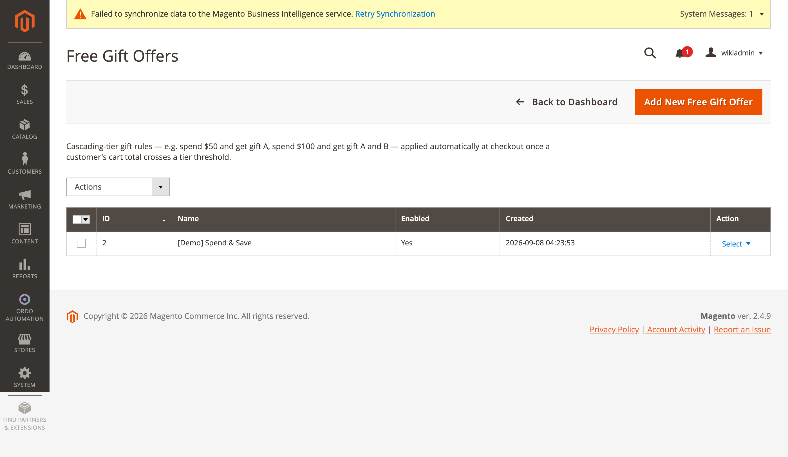
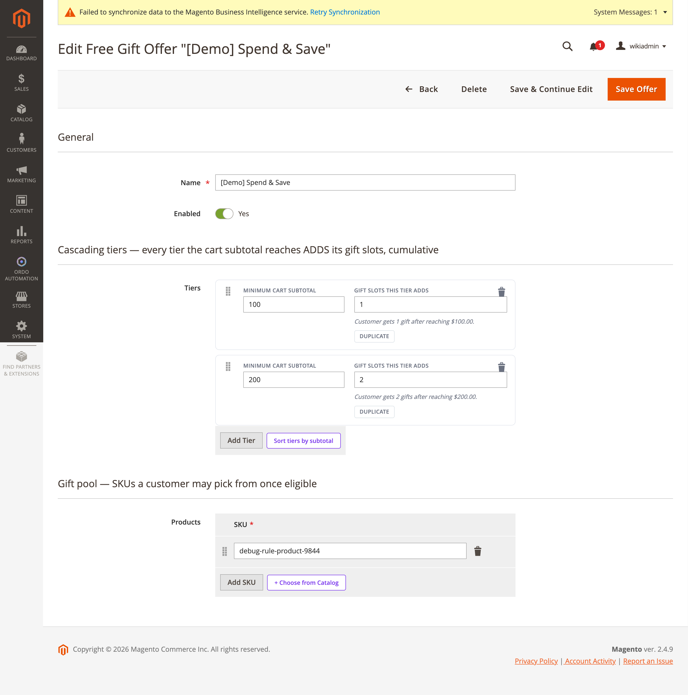

[Polski](#polski) | [English](#english)

# Polski

# Gratisy przy przekroczeniu progu koszyka

**Ordo Automation → Dashboard → Oferty gratisów** (`ordo/freegiftoffer/index`, kontrolery
`Controller/Adminhtml/FreeGiftOffer/*` dziedziczące po `AbstractFreeGiftOfferAction`, zasób ACL
`Ordo_Automation::free_gifts`). Przykład: wydaj 50 zł i dostań gratis A, wydaj 100 zł i dostań
gratis A i B — stosowane automatycznie przy kasie, gdy suma koszyka przekroczy próg danego
poziomu.

## Formularz oferty

Sekcja "Ogólne": Nazwa, Włączona. Sekcja **"Poziomy"** (dynamiczna lista), opisana w interfejsie
jako *"Poziomy kaskadowe — każdy poziom, który suma koszyka osiąga, DODAJE swoje sloty gratisów,
kumulatywnie"* — pola: Minimalna suma koszyka, Sloty gratisów dodawane przez ten poziom. Sekcja
**"Produkty"**, opisana jako *"Pula gratisów — SKU, spośród których klient może wybrać po
zakwalifikowaniu"* — pole: SKU (z przyciskiem wyboru z katalogu).

Powyższy zrzut pokazuje rzeczywistą ofertę demo "[Demo] Spend & Save": poziom 1 przy 100 (1 slot
gratisu), poziom 2 przy 200 (2 sloty gratisów), oraz jedną pozycję w puli produktów.

## Potwierdzone zachowanie kumulacji poziomów

Modele: `Model/FreeGiftOffer.php` / `FreeGiftOfferTier.php` / `FreeGiftOfferProduct.php`,
`Model/FreeGiftManagement.php` (logika wyboru po stronie REST), `Model/QuoteGiftItem.php`
(oznacza, który wiersz koszyka pochodzi z której oferty).

Zweryfikowane w kodzie (`FreeGiftManagement::computeEligibility()`): metoda iteruje przez każdy
poziom każdej aktywnej oferty i dodaje `tier->getGiftSlots()` dla każdego poziomu, którego
`min_subtotal <= suma bazowa koszyka` — czyli przekroczenie poziomu 2 nadal liczy również sloty
poziomu 1. `remaining = max(0, earned - used)`.

`Observer/TrimExcessFreeGifts.php` usuwa gratisy, które przestały się kwalifikować, jeśli suma
koszyka spadnie z powrotem poniżej poziomu.

Konfiguracja: **Stores → Configuration → Ordo Automation → Free Gift Above Threshold** (grupa
`free_gift`) — tylko `enabled`.

---

# English

# Free Gift Above Cart Threshold

**Ordo Automation → Dashboard → Free Gift Offers** (`ordo/freegiftoffer/index`, controllers
`Controller/Adminhtml/FreeGiftOffer/*` extending `AbstractFreeGiftOfferAction`, ACL resource
`Ordo_Automation::free_gifts`). Example: spend $50 and get gift A, spend $100 and get gift A and
B — applied automatically at checkout once a customer's cart subtotal crosses a tier threshold.

## Offer form

"General" section: Name, Enabled. **"Tiers"** section (dynamic rows), labeled in the UI as
*"Cascading tiers — every tier the cart subtotal reaches ADDS its gift slots, cumulative"* —
fields: Minimum cart subtotal, Gift slots this tier adds. **"Products"** section, labeled
*"Gift pool — SKUs a customer may pick from once eligible"* — field: SKU (with a
choose-from-catalog picker).

The screenshot above shows the real demo offer "[Demo] Spend & Save": tier 1 at 100 (1 gift
slot), tier 2 at 200 (2 gift slots), and one product-pool entry.

## Confirmed cumulative-tier behavior

Models: `Model/FreeGiftOffer.php` / `FreeGiftOfferTier.php` / `FreeGiftOfferProduct.php`,
`Model/FreeGiftManagement.php` (the REST-facing selection logic), `Model/QuoteGiftItem.php`
(marks which quote item came from which offer).

Confirmed in code (`FreeGiftManagement::computeEligibility()`): it iterates every tier of every
active offer and adds `tier->getGiftSlots()` for each tier whose `min_subtotal <= cart base
subtotal` — so crossing tier 2 also still counts tier 1's slots. `remaining = max(0, earned -
used)`.

`Observer/TrimExcessFreeGifts.php` removes gifts that no longer qualify if the subtotal drops
back below a tier.

Config: **Stores → Configuration → Ordo Automation → Free Gift Above Threshold** (`free_gift`
group) — just `enabled`.
