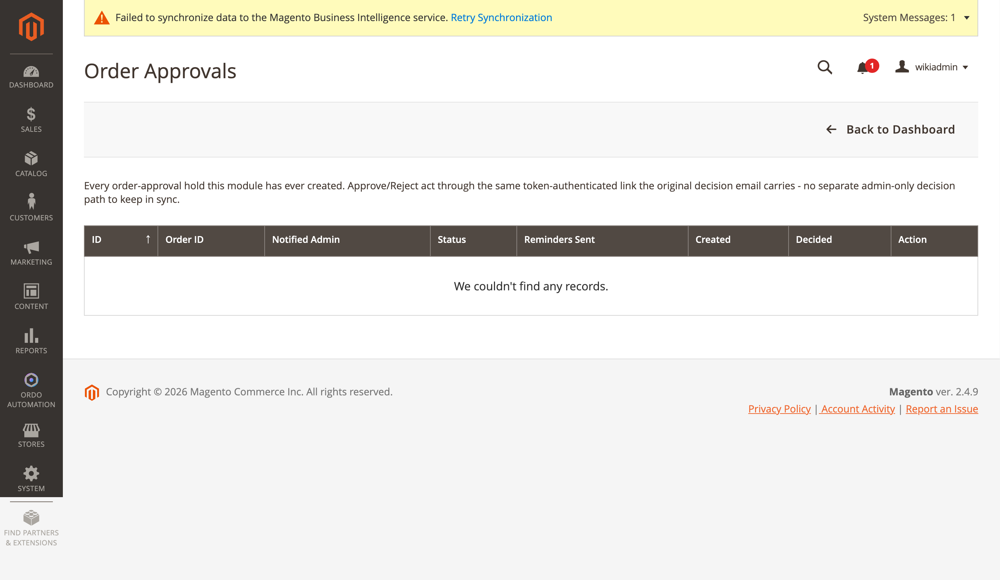

[Polski](#polski) | [English](#english)

# Polski

# Akceptacja zamówień

Zamówienia powyżej limitu wydatków przypisanego klientowi są wstrzymywane do decyzji admina
podjętej przez link e-mail z tokenem, z eskalacją dla nierozstrzygniętych akceptacji.

## Wstrzymanie zamówienia

`Observer/HoldOrderForApproval.php`, na zdarzeniu `sales_order_place_after`. Wymaga, żeby klient
(albo gość, którego e-mail pasuje do zarejestrowanego konta — dopasowanie po e-mailu i witrynie,
żeby uniemożliwić obejście przez zakup jako gość) miał ustawiony zarówno atrybut limitu wydatków,
jak i atrybut e-maila admina do powiadomienia (`Setup/Patch/Data/
AddCustomerSpendLimitAttributes`), oraz żeby `order.grand_total > spend_limit`. Zamówienie
otrzymuje status niestandardowy (dodany przez setup patch, pozostaje w stanie "new", więc
rezerwacja zapasów nie jest naruszana), zostaje zapisane (dopiero to przypisuje mu ID w trakcie
`sales_order_place_after`), po czym tworzony jest wiersz `OrderApproval` (`order_id`,
`admin_email`, `token` z `Random::getUniqueHash()`, `status = PENDING`).

## E-mail akceptacji/odrzucenia

Szablon `ordo_order_approval_request`, wysyłany przez `TransportBuilder`, korzysta z własnego
sklepu zamówienia (`$order->getStore()`, nie "bieżącego" sklepu — celowo, żeby uzyskać poprawny
adres bazowy witryny przy wielu sklepach). Linki: `{baseUrl}/ordo/approval/approve/token/{token}`
i `.../reject/token/{token}`.

Konsumpcja tokenu: `Controller/Approval/Approve.php` / `Reject.php` (dziedziczą po
`AbstractApprovalAction.php`), zarejestrowane na routerze **frontendowym**
(`etc/frontend/routes.xml`, frontName `ordo`) — bez wymaganego logowania.

## Siatka w adminie

**Ordo Automation → Dashboard → Order Approvals** (`ordo/orderapproval/index`, zasób ACL
`Ordo_Automation::order_approval`) — to zapasowa, w pełni funkcjonalna ścieżka administracyjna:
akcje akceptacji/odrzucenia w siatce działają przez ten sam link z tokenem co e-mail decyzyjny,
bez osobnej ścieżki tylko-dla-admina do utrzymywania w synchronizacji.

Kolumny: ID, Order ID, Notified Admin, Status, Reminders Sent, Created, Decided, Action.

## Eskalacja

Cron `Cron/EscalateStalePendingApprovals.php` — ponownie wysyła przypomnienie do admina
bieżącego poziomu (poziom 0 = oryginalny `admin_email`) do `escalation_max_reminders_per_tier`
razy, po czym przechodzi do kolejnego e-maila w skonfigurowanej liście
`escalation_chain_emails`; pusta lista oznacza wieczne przypominanie poziomowi 0. Cron nigdy nie
podejmuje decyzji automatycznie. Szablon: `ordo_order_approval_escalation`.

Konfiguracja: **Stores → Configuration → Ordo Automation → Order Approval Workflow** (grupa
`order_approval`) — `enabled`, `escalation_days` (dni przed eskalacją/ponownym przypomnieniem),
`escalation_max_reminders_per_tier`, `escalation_chain_emails` (textarea, jeden e-mail na linię).

---

# English

# Order Approval Workflow

Orders above a customer's assigned spend limit are held for an admin decision made through a
token-based email link, with escalation for unresolved approvals.

## Holding the order

`Observer/HoldOrderForApproval.php`, on `sales_order_place_after`. Requires the customer (or a
guest whose email matches a registered account — resolved by email + website, to prevent bypass
via guest checkout) to have both a spend-limit attribute and an approval-admin-email attribute
set (`Setup/Patch/Data/AddCustomerSpendLimitAttributes`), and `order.grand_total > spend_limit`.
The order gets a custom status (added via setup patch, stays in the "new" state so inventory
reservation is untouched), is saved (this is what assigns the order its entity id within
`sales_order_place_after`), then an `OrderApproval` row is created (`order_id`, `admin_email`,
`token` via `Random::getUniqueHash()`, `status = PENDING`).

## Approve/reject email

Template `ordo_order_approval_request`, sent via `TransportBuilder`, uses the order's own store
(`$order->getStore()`, not the "current" store — deliberately, to get the right storefront base
URL on multi-store). Links: `{baseUrl}/ordo/approval/approve/token/{token}` and
`.../reject/token/{token}`.

Token consumption: `Controller/Approval/Approve.php` / `Reject.php` (extend
`AbstractApprovalAction.php`), registered on the **frontend** router (`etc/frontend/routes.xml`,
frontName `ordo`) — no login required.

## Admin grid

**Ordo Automation → Dashboard → Order Approvals** (`ordo/orderapproval/index`, ACL resource
`Ordo_Automation::order_approval`) — a real, fully functional in-backend fallback path: the
grid's approve/reject row actions act through the same token-authenticated link the decision
email carries, no separate admin-only decision path to keep in sync.

Columns: ID, Order ID, Notified Admin, Status, Reminders Sent, Created, Decided, Action.

## Escalation

`Cron/EscalateStalePendingApprovals.php` re-sends the reminder to the current tier's admin (tier
0 = the original `admin_email`) up to `escalation_max_reminders_per_tier` times, then advances to
the next email in the configured `escalation_chain_emails` list; an empty chain re-reminds tier 0
forever. The cron never auto-decides. Email template: `ordo_order_approval_escalation`.

Config: **Stores → Configuration → Ordo Automation → Order Approval Workflow**
(`order_approval` group) — `enabled`, `escalation_days` (days before escalating/re-reminding),
`escalation_max_reminders_per_tier`, `escalation_chain_emails` (textarea, one email per line).
