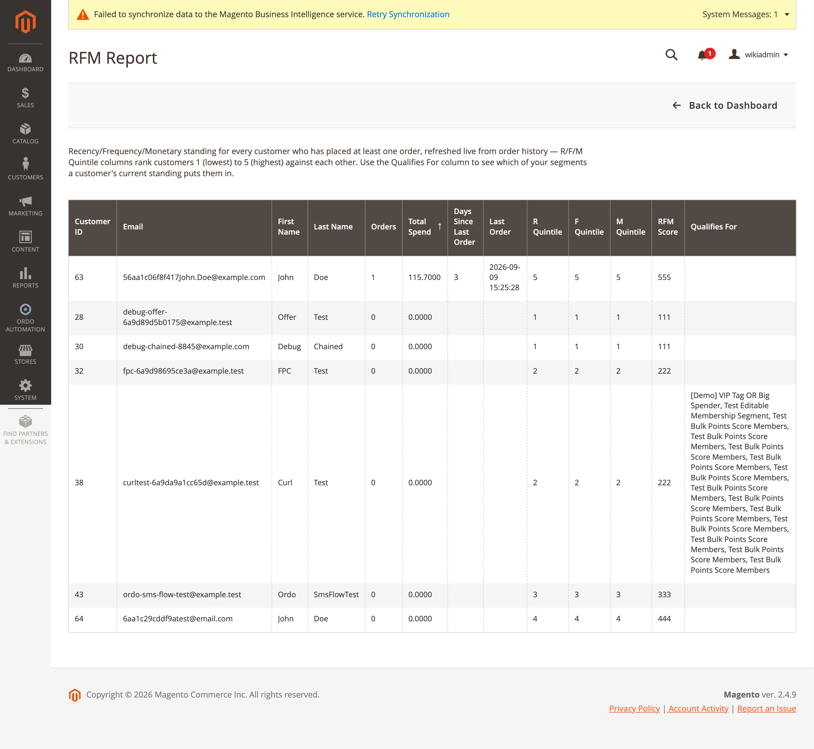
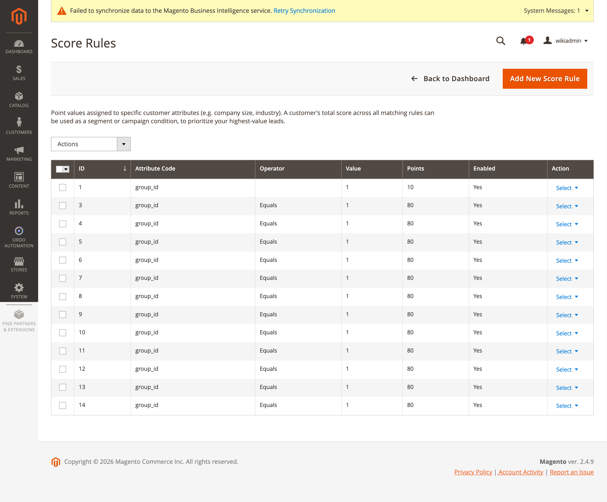

[Polski](#polski) | [English](#english)

# Polski

# RFM i lead scoring

## Raport RFM

**Ordo Automation → Dashboard → Raport RFM** (`ordo/rfm/index`, `Controller/Adminhtml/Rfm/
Index.php`, własny, dedykowany zasób ACL `Ordo_Automation::rfm`, niezależny od uprawnień do
segmentów). Siatka pokazuje status Recency/Frequency/Monetary dla każdego klienta, który złożył
co najmniej jedno zamówienie — kolumny R/F/M Quintile rankingują klientów od 1 (najniższy) do 5
(najwyższy) względem siebie nawzajem, plus kolumna "Qualifies For" pokazująca, do których
segmentów bieżący status klienta go kwalifikuje.

Kalkulator: `Model/Rfm/RfmCalculator.php` — `getRecencyDays`, `getFrequency`,
`getMonetaryTotal`, `getPercentileRanks()` (wzór percentyla udokumentowany w kodzie: `liczba
klientów z metryką ≤ metryka(c) / N * 100`, odwrócony dla recency, żeby 100 zawsze oznaczało
"najlepszy"). Wyniki cache'owane w ramach żądania plus TTL (`PERCENTILE_CACHE_TTL_SECONDS`).
Nocny cron `Cron/RecomputeRfmScores.php` odświeża dane zasilające trzy warunki segmentowe RFM
(`recency_percentile_at_least`, `order_frequency_percentile_at_least`,
`monetary_percentile_at_least`).

`MassDelete.php` na tym ekranie **nie usuwa klientów** — resetuje cache'owane wiersze
`ordo_customer_rfm_score` przez `RfmCalculator::resetScoresForCustomers()`; kolejny przebieg
crona odtwarza je od nowa.

## Lead scoring — reguły punktacji

**Ordo Automation → Dashboard → Reguły punktacji** (`ordo/scorerule/index`, kontrolery
`Controller/Adminhtml/ScoreRule/*` dziedziczące po `AbstractScoreRuleAction`, zasób ACL
`Ordo_Automation::score_rules`).

Formularz (`view/adminhtml/ui_component/ordo_scorerule_form.xml`): Atrybut, Operator, Wartość,
Punkty, Kolejność sortowania, Włączona (źródło operatorów:
`Model/Config/Source/ScoreRuleOperator.php`). Modele: `Model/ScoreRule.php`,
`Model/ScoreRule/ScoreRuleEvaluator.php` — dopasowuje standardowe gettery `CustomerInterface`
(np. `group_id`) oraz własne atrybuty EAV; `Model/CustomerScoreManager.php` trzyma bieżący stan
wyniku. Obserwatory: `EvaluateCustomerScoreRules.php` przelicza wynik przy istotnych zdarzeniach
klienta; `DispatchScoreThresholdCampaigns.php` wyzwala trigger kampanii
`score_threshold_crossed`.

Konfiguracja: **Stores → Configuration → Ordo Automation → Lead Scoring** (grupa
`lead_scoring`) — `enabled`, `score_threshold`, `loyalty_silver_threshold`,
`loyalty_gold_threshold`.

---

# English

# RFM and Lead Scoring

## RFM Report

**Ordo Automation → Dashboard → RFM Report** (`ordo/rfm/index`, `Controller/Adminhtml/Rfm/
Index.php`, its own dedicated ACL resource `Ordo_Automation::rfm`, independent of the segments
permission). The grid shows Recency/Frequency/Monetary standing for every customer who has placed
at least one order — R/F/M Quintile columns rank customers 1 (lowest) to 5 (highest) against each
other, plus a "Qualifies For" column showing which segments a customer's current standing puts
them in.

Calculator: `Model/Rfm/RfmCalculator.php` — `getRecencyDays`, `getFrequency`,
`getMonetaryTotal`, `getPercentileRanks()` (percentile formula documented in code:
`count(customers with metric ≤ metric(c)) / N * 100`, inverted for recency so 100 is always
"best"). Cached in-request plus a TTL constant (`PERCENTILE_CACHE_TTL_SECONDS`). A nightly cron
(`Cron/RecomputeRfmScores.php`) refreshes the data feeding the three RFM segment condition types
(`recency_percentile_at_least`, `order_frequency_percentile_at_least`,
`monetary_percentile_at_least`).

`MassDelete.php` on this screen does **not** delete customers — it resets cached
`ordo_customer_rfm_score` rows via `RfmCalculator::resetScoresForCustomers()`; the next cron
recompute repopulates them.

## Lead scoring — Score Rules

**Ordo Automation → Dashboard → Score Rules** (`ordo/scorerule/index`, controllers
`Controller/Adminhtml/ScoreRule/*` extending `AbstractScoreRuleAction`, ACL resource
`Ordo_Automation::score_rules`).

Form (`view/adminhtml/ui_component/ordo_scorerule_form.xml`): Attribute, Operator, Value, Points,
Sort Order, Enabled (operator source: `Model/Config/Source/ScoreRuleOperator.php`). Models:
`Model/ScoreRule.php`, `Model/ScoreRule/ScoreRuleEvaluator.php` — matches core
`CustomerInterface` getters (e.g. `group_id`) plus EAV custom attributes;
`Model/CustomerScoreManager.php` holds the running score state. Observers:
`EvaluateCustomerScoreRules.php` recomputes on relevant customer events;
`DispatchScoreThresholdCampaigns.php` fires the `score_threshold_crossed` campaign trigger.

Config: **Stores → Configuration → Ordo Automation → Lead Scoring** (`lead_scoring` group) —
`enabled`, `score_threshold`, `loyalty_silver_threshold`, `loyalty_gold_threshold`.
