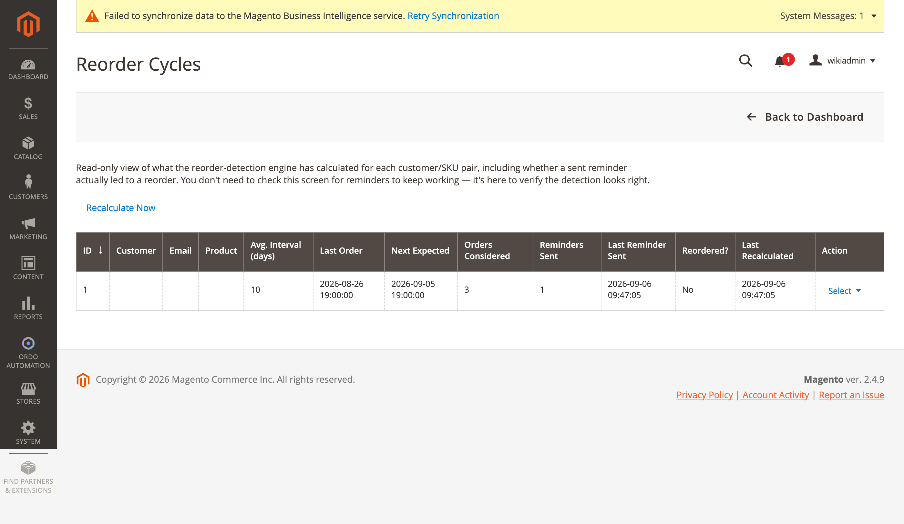

[Polski](#polski) | [English](#english)

# Polski

# Cykle ponownych zakupów

**Ordo Automation → Dashboard → Reorder Cycles** (`ordo/reordercycle/index`,
`Controller/Adminhtml/ReorderCycle/Index.php`, własny, dedykowany zasób ACL
`Ordo_Automation::reorder_cycle`, niezależny od zasobu kampanii). Ekran jest w kodzie wprost
opisany jako **diagnostyka tylko do odczytu** — nie da się edytować ani usunąć samego wykrycia
wzorca, jedynie zbiorczo usunąć wiersze siatki oraz wywołać dwie akcje wierszowe.

## Siatka

Kolumny (`view/adminhtml/ui_component/ordo_reorder_cycle_listing.xml`): ID, Customer, Email,
Product, SKU, Avg. Interval (days), Last Order, Next Expected, Orders Considered, Reminders Sent,
Last Reminder Sent, Reordered?, Last Recalculated. Przycisk paska narzędzi: "Back to Dashboard".

Powyższy zrzut pokazuje rzeczywisty wykryty wzorzec: średni odstęp 10 dni, 3 wzięte pod uwagę
zamówienia, 1 wysłane przypomnienie, jeszcze bez ponownego zakupu.

## Akcje wierszowe

`Ui/Component/Listing/Column/ReorderCycleActions.php` dodaje dwie akcje z oknem potwierdzenia:

- **Send Reminder Now** (`send_reminder`) — kontroler
  `Controller/Adminhtml/ReorderCycle/SendReminder.php`.
- **Build Cart** (`build_cart`) — kontroler `Controller/Adminhtml/ReorderCycle/BuildCart.php`,
  używa `Model/ReorderCycle/ReorderCartBuilder.php`, który ponownie wykorzystuje standardowe
  `Backend\Model\Session\Quote` + `Sales\Model\AdminOrder\Create` Magento (ta sama ścieżka, którą
  przechodzi sprzedawca budujący zamówienie ręcznie) — ustawia klienta/sklep na współdzielonej
  sesji admina, dodaje produkt reorder i przekierowuje do prawdziwego ekranu "Create New Order"
  już wypełnionego danymi.

Osobno: `Controller/Adminhtml/ReorderCycle/RecalculateNow.php`.

## Wykrywanie i przypomnienia

Wykrywanie: `Cron/CalculateReorderCycle.php`, zasila `Model/ReorderCycle.php`. Wysyłka
przypomnień: `Cron/SendReorderReminders.php`.

Konfiguracja: **Stores → Configuration → Ordo Automation → Reorder Reminder** (grupa `reorder`)
— `enabled`, `min_orders` (minimalna liczba zamówień do wykrycia wzorca), `lead_days` (wyślij
przypomnienie tyle dni przed oczekiwaną datą).

---

# English

# Reorder Cycles

**Ordo Automation → Dashboard → Reorder Cycles** (`ordo/reordercycle/index`,
`Controller/Adminhtml/ReorderCycle/Index.php`, its own dedicated ACL resource
`Ordo_Automation::reorder_cycle`, independent of the campaigns resource). The screen is
explicitly documented in code as a **read-only diagnostic** — no editing or deleting the
underlying detection itself, only a mass "Delete" on the grid rows and two row actions.

## Grid

Columns (`view/adminhtml/ui_component/ordo_reorder_cycle_listing.xml`): ID, Customer, Email,
Product, SKU, Avg. Interval (days), Last Order, Next Expected, Orders Considered, Reminders Sent,
Last Reminder Sent, Reordered?, Last Recalculated. Toolbar button: "Back to Dashboard".

The screenshot above shows a real detected pattern: 10-day average interval, 3 orders considered,
1 reminder sent, not yet reordered.

## Row actions

`Ui/Component/Listing/Column/ReorderCycleActions.php` adds two confirm-dialog actions:

- **Send Reminder Now** (`send_reminder`) — controller
  `Controller/Adminhtml/ReorderCycle/SendReminder.php`.
- **Build Cart** (`build_cart`) — controller `Controller/Adminhtml/ReorderCycle/BuildCart.php`,
  using `Model/ReorderCycle/ReorderCartBuilder.php`, which reuses Magento's own
  `Backend\Model\Session\Quote` + `Sales\Model\AdminOrder\Create` (the same path a merchant takes
  building an order by hand) — sets customer/store on the shared admin session, adds the reorder
  product, and redirects into the real "Create New Order" screen already populated.

Separately: `Controller/Adminhtml/ReorderCycle/RecalculateNow.php`.

## Detection and reminders

Detection: `Cron/CalculateReorderCycle.php` populates `Model/ReorderCycle.php`. Reminder sending:
`Cron/SendReorderReminders.php`.

Config: **Stores → Configuration → Ordo Automation → Reorder Reminder** (`reorder` group) —
`enabled`, `min_orders` (minimum orders to detect a pattern), `lead_days` (send N days before
expected date).
