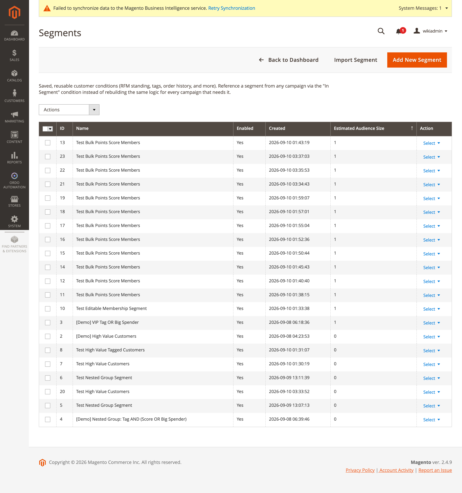

[Polski](#polski) | [English](#english)

# Polski

# Segmenty

**Ordo Automation → Dashboard → Segmenty** (`ordo/segment/index`, kontrolery
`Controller/Adminhtml/Segment/*` dziedziczące po `AbstractSegmentAction`, zasób ACL
`Ordo_Automation::segments`). Segment to zapisany, wielokrotnego użytku zestaw warunków klienta
(status RFM, tagi, historia zamówień i więcej) — kampania odwołuje się do segmentu przez warunek
"W segmencie" zamiast odtwarzać tę samą logikę w każdej kampanii, która jej potrzebuje.

## Siatka i formularz

Kolumny siatki: ID, Nazwa, Włączony, Data utworzenia, Szacowana wielkość odbiorców
(`ordo_segment_listing.xml`).

Formularz (`view/adminhtml/ui_component/ordo_segment_form.xml`): Nazwa, Włączony, nadrzędny
selektor logiki "Segment pasuje" (wszystkie/którykolwiek), dynamiczna lista "Warunki" z polami
zależnymi od typu: Tag, minimalna suma zamówienia, minimalny wynik punktowy, maksymalna liczba dni
od ostatniego zamówienia, minimalna liczba zamówień, minimalny percentyl (0–100), zapasowe pole
"Parametry (JSON)", plus zagnieżdżony podformularz grupy (logika grupy + warunki grupy jako JSON)
oraz pola specyficzne dla warunku SKU/Kategoria, Zdarzenie/SKU/"w ciągu dni", Segment (w/nie w),
Minimalny poziom.

Model przechowywania: `Model/Segment.php`, `Model/SegmentCondition.php` — płaskie wiersze
łączone przez AND, plus zarezerwowany wiersz pseudo-typu `'group'` trzymający własny blob
`{"logic":"all"|"any","conditions":[...]}` (tylko jeden poziom zagnieżdżenia).
`Model/Segment/SegmentSaveProcessor.php` zapisuje przez usunięcie i ponowne wstawienie wierszy.
Dopasowywanie: `Model/Segment/SegmentMemberResolver.php` + `Model/Segment/SegmentMatcher.php`.

## Akcje zbiorcze na bieżących członkach

Na stronie edycji segmentu, poniżej warunków: prosty formularz HTML (nie ui_component,
`Block/Adminhtml/Segment/BulkActions.php`) z selektorem typu akcji (dodaj tag / dodaj punkty),
polem tekstowym tagu i polem liczbowym punktów, wysyłający do
`Controller/Adminhtml/Segment/BulkAction.php`.

## Nakładanie się segmentów

Osobne narzędzie `ordo/segment/overlap` (`Controller/Adminhtml/Segment/Overlap.php` +
`OverlapCompute.php`) pokazuje, ilu klientów należy jednocześnie do wybranych segmentów.

> 📷 Zrzut ekranu formularza edycji segmentu (z widocznymi warunkami i grupą zagnieżdżoną) —
> do uzupełnienia: `admin/ordo/segment/edit/entity_id/<id>`, np. dla segmentu demo "[Demo] Nested
> Group: Tag AND (Score OR Big Spender)".

---

# English

# Segments

**Ordo Automation → Dashboard → Segments** (`ordo/segment/index`, controllers
`Controller/Adminhtml/Segment/*` extending `AbstractSegmentAction`, ACL resource
`Ordo_Automation::segments`). A segment is a saved, reusable set of customer conditions (RFM
standing, tags, order history, and more) — a campaign references a segment via the "In Segment"
condition instead of rebuilding the same logic for every campaign that needs it.

## Grid and form

Grid columns: ID, Name, Enabled, Created, Estimated Audience Size (`ordo_segment_listing.xml`).

Form (`view/adminhtml/ui_component/ordo_segment_form.xml`): Name, Enabled, a top-level "Segment
matches" logic selector (all/any), a dynamic-rows "Conditions" list with per-type fields: Tag,
minimum order total, minimum score, recency days at most, order count at least, percentile at
least (0–100), a fallback "Params (JSON)" field, plus a nested-group sub-form (group logic + group
conditions as JSON) and condition-specific fields for SKU/Category, Event/SKU/"within days",
Segment (in/not-in), Minimum tier.

Persistence: `Model/Segment.php`, `Model/SegmentCondition.php` — flat, AND-joined rows, plus a
reserved `'group'` pseudo-type row holding its own `{"logic":"all"|"any","conditions":[...]}` blob
(one level of nesting only). `Model/Segment/SegmentSaveProcessor.php` persists by delete-and-
reinsert. Matching: `Model/Segment/SegmentMemberResolver.php` + `Model/Segment/SegmentMatcher.php`.

## Bulk actions on current members

On the segment edit page, below the conditions: a plain HTML form (not a ui_component,
`Block/Adminhtml/Segment/BulkActions.php`) with an action-type select (add tag / add points), a
tag text input, and a points number input, posting to
`Controller/Adminhtml/Segment/BulkAction.php`.

## Segment overlap

A separate tool at `ordo/segment/overlap` (`Controller/Adminhtml/Segment/Overlap.php` +
`OverlapCompute.php`) shows how many customers belong to several chosen segments at once.

> 📷 A screenshot of the segment edit form (showing conditions and a nested group) is still
> needed — to do: `admin/ordo/segment/edit/entity_id/<id>`, e.g. for the demo segment "[Demo]
> Nested Group: Tag AND (Score OR Big Spender)".
