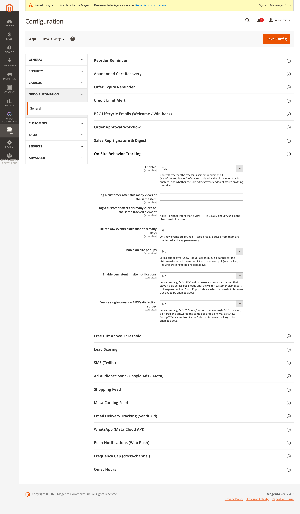

[Polski](#polski) | [English](#english)

# Polski

# Śledzenie zachowań on-site i popupy

## Snippet śledzący

Punkt końcowy: `Controller/Track/Event.php` (publiczny, zwolniony z CSRF).
`Model/VisitorEventLogger.php` zapisuje `ordo_visitor_event` i wyzwala
`Model/VisitorAggregator.php` (surowe zdarzenia → tagi `ordo_customer_tag` przy przekroczeniu
progu), gdy tożsamość jest już znana.

Snippet: `view/frontend/web/js/tracker.js` — bez zależności, zwykły tag `<script>`, cookie
`ordo_visitor_id` (365 dni). Zawsze wysyła `page_view` przy ładowaniu; wysyłanie
`product_view`/`category_view`/kliknięć elementów wymaga, żeby motyw wywołał
`window.ordoTrack(eventType, eventKey)` (brak automatycznego wykrywania typu strony).

## Popupy — prawdziwa funkcja, nie tylko śledzenie

Akcja kampanii `popup` (etykieta "Show Popup", klasa `Model/Campaign/Action/ShowPopup.php`) nie
wypycha niczego synchronicznie — kolejkuje wiersz w `ordo_pending_popup`
(`Model/PendingPopup.php`), a `tracker.js` odpytuje `Controller/Track/Popup.php`
(`POPUP_ENDPOINT = /ordo/track/popup`), żeby pobrać i wyrenderować popup (element
`ordo-popup-banner`). Parametry: `{"headline","body","cta_label","cta_url"}`. Ograniczone
częstotliwością (cichy brak działania, jeśli cel już otrzymał popup w skonfigurowanym oknie).

Powiązane, oparte na tym samym mechanizmie odpytywania:

- **Trwałe powiadomienia** — akcja `notify`, `/ordo/track/notification` +
  `/ordo/track/dismissnotification`. W przeciwieństwie do popupu (jednorazowy), baner
  niemodalny, widoczny na kolejnych stronach aż klient go odrzuci lub wygaśnie.
- **Ankieta NPS/satysfakcji** — akcja `nps_survey`, `/ordo/track/survey` +
  `/ordo/track/submitsurveyresponse`. Jedno pytanie 0–10.

Wszystkie trzy sprzątane przez dedykowane crony: `PrunePendingPopups`, `PruneNotifications`,
`PruneSurveyPrompts`, `PruneVisitorEvents`.

## Konfiguracja

**Stores → Configuration → Ordo Automation → On-Site Behavior Tracking** (grupa `tracking`):
`enabled` (kontroluje, czy snippet `tracker.js` w ogóle się renderuje — `view/frontend/layout/
default.xml` dodaje blok tylko przy włączonej opcji — i czy endpoint `/ordo/track/event` w ogóle
coś zapisuje), `view_threshold` (tag po tylu wyświetleniach tego samego produktu),
`click_threshold` (tag po tylu kliknięciach śledzonego elementu), `retention_days` (usuwaj surowe
zdarzenia starsze niż tyle dni — tylko surowe zdarzenia są czyszczone, wyprowadzone z nich tagi
zostają na stałe), `popup_enabled`, `popup_poll_interval_seconds`, `popup_frequency_cap_hours`,
`notification_enabled`, `notification_poll_interval_seconds`, `nps_survey_enabled`,
`nps_survey_poll_interval_seconds`.

Powyższy zrzut to rzeczywisty ekran konfiguracji (domyślny zakres): śledzenie włączone, popupy /
powiadomienia / ankieta NPS domyślnie wyłączone, z opisami pól widocznymi pod każdym polem —
dokładnie tak, jak je odczytano z `system.xml`.

---

# English

# On-Site Behavior Tracking and Popups

## Tracking snippet

Endpoint: `Controller/Track/Event.php` (public, CSRF-exempt). `Model/VisitorEventLogger.php`
writes `ordo_visitor_event` and triggers `Model/VisitorAggregator.php` (raw events → threshold-
crossing `ordo_customer_tag` tags) once identity is known.

Snippet: `view/frontend/web/js/tracker.js` — dependency-free, a plain `<script>` tag, cookie
`ordo_visitor_id` (365 days). Always fires `page_view` on load; firing
`product_view`/`category_view`/element clicks requires the theme to call
`window.ordoTrack(eventType, eventKey)` (no automatic page-type detection).

## Popups — a real feature, not just tracking

Campaign action `popup` (label "Show Popup", class `Model/Campaign/Action/ShowPopup.php`) doesn't
push anything synchronously — it queues a row in `ordo_pending_popup`
(`Model/PendingPopup.php`), and `tracker.js` polls `Controller/Track/Popup.php`
(`POPUP_ENDPOINT = /ordo/track/popup`) to fetch and render it (`ordo-popup-banner` element).
Params: `{"headline","body","cta_label","cta_url"}`. Frequency-capped (silent no-op if the target
already got a popup within the configured window).

Related, built on the same polling mechanism:

- **Persistent notifications** — the `notify` action, `/ordo/track/notification` +
  `/ordo/track/dismissnotification`. Unlike "Show Popup" (one-shot), a non-modal banner stays
  visible across page loads until the visitor/customer dismisses it or it expires.
- **NPS/satisfaction survey** — the `nps_survey` action, `/ordo/track/survey` +
  `/ordo/track/submitsurveyresponse`. A single 0–10 question.

All three are pruned by dedicated crons: `PrunePendingPopups`, `PruneNotifications`,
`PruneSurveyPrompts`, `PruneVisitorEvents`.

## Configuration

**Stores → Configuration → Ordo Automation → On-Site Behavior Tracking** (`tracking` group):
`enabled` (controls whether the `tracker.js` snippet renders at all —
`view/frontend/layout/default.xml` only adds the block when enabled — and whether the
`/ordo/track/event` endpoint stores anything it receives), `view_threshold` (tag a customer after
this many views of the same item), `click_threshold` (tag after this many clicks on the same
tracked element), `retention_days` (delete raw events older than this many days — only raw events
are pruned, tags already derived from them stay permanently), `popup_enabled`,
`popup_poll_interval_seconds`, `popup_frequency_cap_hours`, `notification_enabled`,
`notification_poll_interval_seconds`, `nps_survey_enabled`, `nps_survey_poll_interval_seconds`.

The screenshot above is the real configuration screen (default scope): tracking enabled, popups /
notifications / NPS survey off by default, with field descriptions visible under each field —
exactly as read from `system.xml`.
